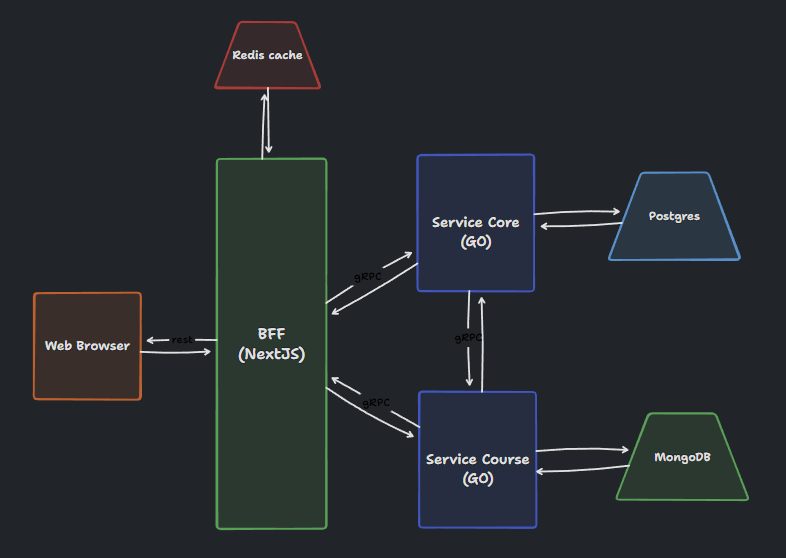

# PLATAFORMA EAD

## 📃 SOBRE

Projeto de uma plataforma de ensino a distância(EAD) utilizando microsserviços em GO e também Next 13.

## 🔧 TOOLS

O projeto está sendo desenvolvido utilizando as seguintes tecnologias

- [NextJS](https://nextjs.org/)
- [GO](https://go.dev/)
- [PostgreSQL](https://www.postgresql.org/)
- [MongoDB](https://www.mongodb.com/)
- [gRPC](https://grpc.io/)

## SERVICES

O projeto vai contar com dois microsserviços e uma BFF/Front

### Arquitetura do projeto

### BFF/Front

Vamos utilizar o NextJS como BFF e tembém como front-end da aplicação.

### Service Core

Serviço principal da plataforma.

🔧 Techs:

- GO
- PostgresSQL

🎯 Responsabilidades:

- Cadastro e alteração de usuários
- Autorização e autenticação de usuarios
- Gerenciamento de usuarios da plataforma
- Gerenciamento de matriculas de curso
- Avaliação de atividades

### Service course

Serviço para o gerenciamento e disponibilização de cursos.

🔧 Techs:

- GO
- Banco de dados MongoDB

🎯 Responsabilidades:

- Cadastro e alteração de cursos
- Upload de arquivos
- Streaming de videos
- Gerenciamento de progresso de curso

