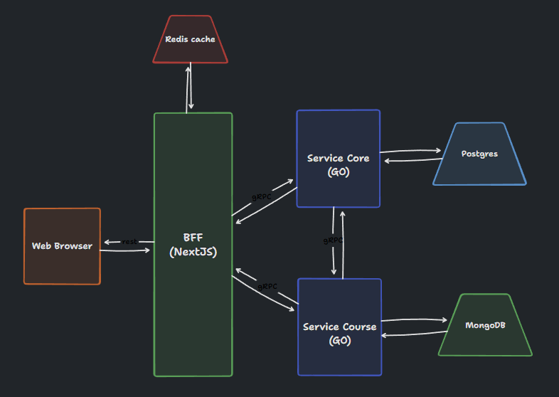

<h1 align="center">
    PLATAFORMA EAD
</h1>

<h3 align="center"> ⚛️ 📄 🚀 </h3>

 

  

  

  

  

  

## 🌎 SOBRE

A plataforma de ensino a distância (EAD) é um projeto em desenvolvimento que utiliza a arquitetura de microsserviços em GO e o framework Next.js 13. O objetivo é fornecer uma solução eficiente para o ensino à distância, permitindo a criação, gerenciamento e entrega de cursos online de alta qualidade.

> [!WARNING]  
> Este projeto está em desenvolvimento e está sub a licença [MIT](LICENSE).

## 🚀 FERRAMENTAS

O projeto está sendo desenvolvido utilizando as seguintes tecnologias

- [NextJS](https://nextjs.org/): Um framework React para construir interfaces web modernas.
- [GO](https://go.dev/): A linguagem de programação Go, conhecida por sua eficiência e desempenho.
- [PostgreSQL](https://www.postgresql.org/): Um SGBD relacional de código aberto e eficiente.
- [MongoDB](https://www.mongodb.com/): Um banco de dados orientado a documentos, de código aberto e multiplataforma.
- [gRPC](https://grpc.io/): Um framework RPC de código aberto para comunicação entre microsserviços.

## 📑 SERVIÇOS

O projeto vai contar com dois microsserviços e uma BFF/Front

### Arquitetura do projeto

### BFF/Front

O Next.js é utilizado tanto como BFF (Backend for Frontend) quanto como front-end da aplicação, proporcionando uma experiência de usuário com alta performance e SEO.

### Service Core

O Service Core é o principal serviço da plataforma, desempenhando funções críticas. Utiliza as seguintes tecnologias:

- Linguagem GO
- Banco de dados PostgreSQL

Principais Responsabilidades:

- Cadastro e atualização de usuários
- Autorização e autenticação de usuários
- Gerenciamento de usuários da plataforma
- Gerenciamento e controle de matriculas de cursos
- Avaliação de atividades

### Service course

O Service Course é responsável pelo gerenciamento e disponibilização de cursos. Ele faz uso das seguintes tecnologias:

- Linguagem GO
- Banco de dados NoSQL MongoDB

Principais Responsabilidades:

- Cadastro e atualização de cursos
- Upload de arquivos
- Streaming de vídeos
- Gerenciamento de progresso de curso
